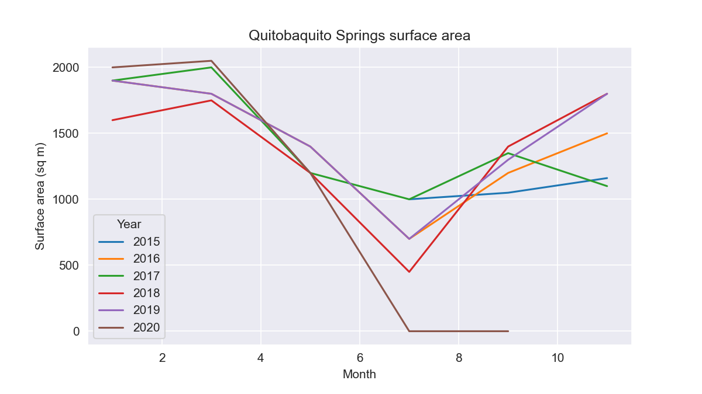
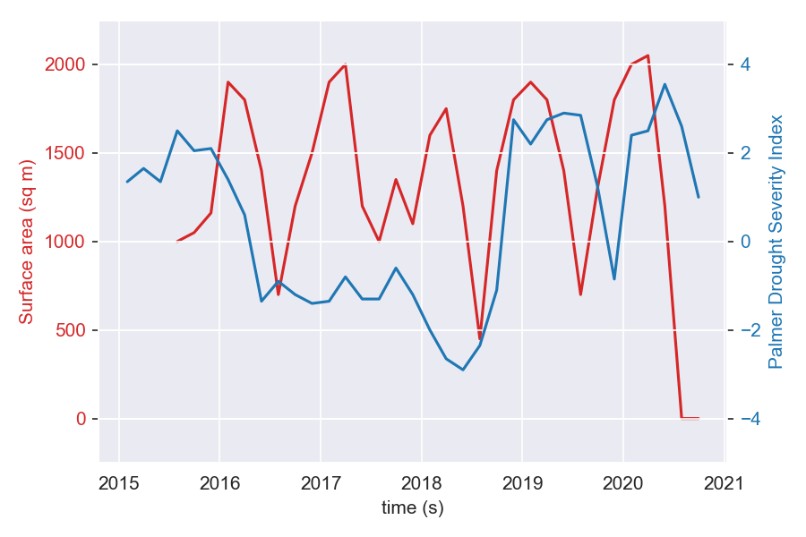

# Quitobaquito Earth Engine analysis

`earth-engine.js` is a script to be run on Google Earth Engine. Earth Engine generates the NDWI and PDSI data in `ndwi.csv` and `drought-data.csv` data files. These files are processed by a Jupyter notebook, `quitobaquito.ipynb`, to generate two graphs:

